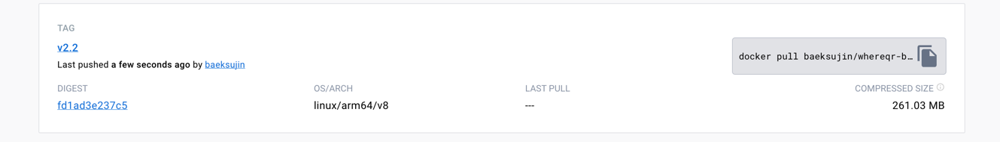
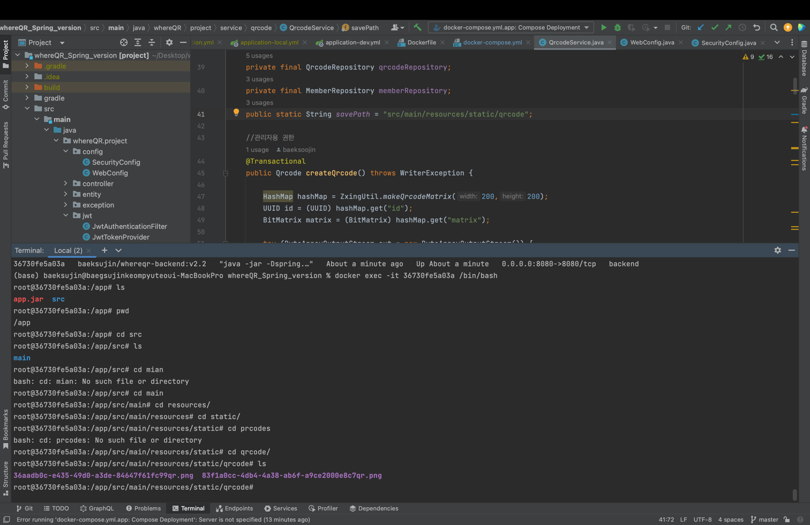

# whereQR_Spring_version

**whereQR이 무엇인가요??**


[whereQr이란?](https://towering-beach-ce0.notion.site/whereQR-sprint1-2a8a1b1f9dba4ee697d6785cd8019f08?pvs=4 ) 에서 확인이 가능합니다.


> [기존 WhereQr](https://github.com/baeksoojin/whereQR) 에서 backend 부분을 변경하는 레포입니다.

- 큰 틀의 계획은 [ 기존 whereQr issue](https://github.com/baeksoojin/whereQR/issues/1)에서 확인가능합니다.
- 세부 **code** 작성관리 및 issue는 [해당프로젝트](https://github.com/baeksoojin/whereQR_Spring_version/projects?query=is%3Aopen)에서 확인 가능합니다.


## 🛠 setting

- 개발완료 후 docker multicontainer 하나의 앱으로 관리할 예정입니다.

```
docker compose up -d
```

- 개발진행중일 때는 backend는 직접 실행시켜줍니다.

frontend, database
```
docker compose up -d
```
컨테이너로 빌드합니다.
database는 본인의 password를 gitignore의 위치에서 ```db_password.txt```를 만들어 입력합니다.

backend
```
src/main/java/backend/BackendApplication 
```
Run을 시켜줍니다.

## 🎈python/Django 에서 java/Spring 로 전면 수정

- 애플리케이션 확장을 위해 더 객체지향적인 java를 사용해 개발
- python 코드중 쓸데없이 작성됐고 구조화 되어있지 않은 부분을 전부 없애거나 리팩토링 진행

## 🌱 api 배포

- 협업을 위해, localhost가 아닌 EC2의 탄력적 ip를 사용해 api를 제공
**[postman](https://documenter.getpostman.com/view/19525584/2s946fdY9k)** 에서 체크 가능 -> **docker image 활용해서 test가능**

### dockerfile build후 docker hub에 배포
1. docker hub에 배포된 image ( baeksujin/whereqr-backend:v2.2 )

2. qrcode image 저장된 경로 ( /app/src/main/resources/static/qrcode )

3. qrcode 이미지 얻는 방법
```
docker cp 36730fe5a03a:/app/src/main/resources/static/qrcode .
```

36730fe5a03a : image container id 입니다.<br>
. : 해당 명령어를 실행하는 경로로, docker container에 저장된 qrcode folder를 복사할 위치를 의미합니다.<br> 


### CI/CD 구축 단계(Jenkins 활용)

1. 프리티어로 중단 -> 동국대학교 창업동아리 선정(완료). -> 지원금 활용 예정.<br>


